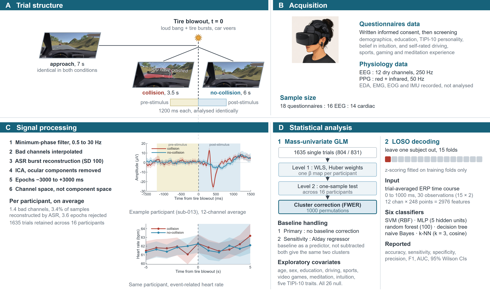
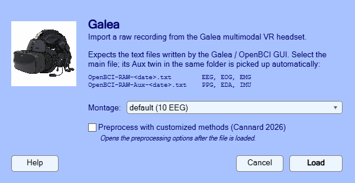
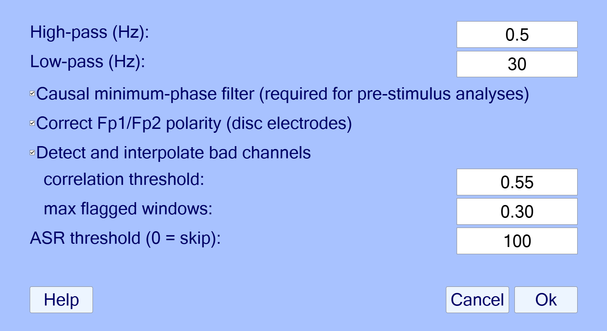
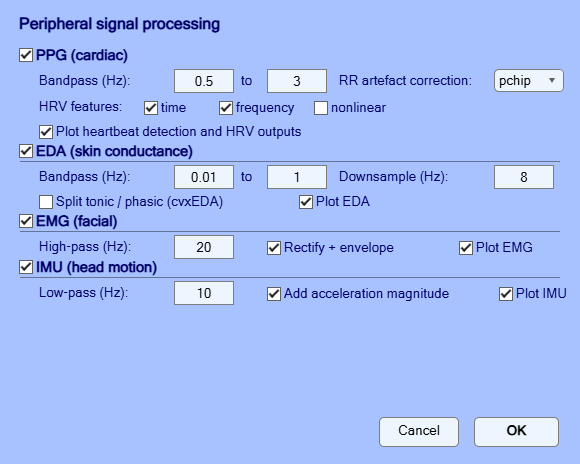

# Reactive and predictive processes during unpredictable driving hazards in virtual reality



Pre- and post-stimulus neurophysiology of unpredictable car collisions in immersive virtual
reality, recorded with the Galea multimodal headset (OpenBCI) integrated into a Varjo Aero HMD.

Cannard, C., & Yeşilbaş, D. (2026). *Reactive and predictive processes during
unpredictable driving hazards in virtual reality: an exploratory brain and body
study with multimodal neurophysiological monitoring.* Supported by the BIAL
Foundation. Preregistered at [osf.io/xuw34](https://osf.io/xuw34).

## Layout

| Folder | Contents |
|---|---|
| `pipeline/` | Per-subject preprocessing. `galea_pipeline_v6_EEG.m` is current; `functions/` holds the Galea-specific helpers (import, event renaming, polarity correction, bad-channel detection). `galea_pipeline_v5_ppg.m` produces the per-subject heart-rate exports (`ERP_PPG.mat`) the cardiac analysis reads. `convert_to_bids.m` converts the study data to BIDS + HED; `rebuild_erp_from_bids.m` regenerates the per-subject exports from the BIDS derivative; `verify_bids_roundtrip.m` checks the round-trip against the original exports. |
| `analysis/` | Group-level analyses. Everything named `run_final_*` operates on the repaired dataset and writes to `results_final/`. |
| `manuscript/` | `build_manuscript.js` generates the .docx from the result files, plus the current draft and the earlier versions. |
| `results_final/` | Output of the current analyses. Superseded folders were removed; they are archived in the study's Proton Drive archive (`code_archive/results_superseded/`). |
| `data/` | `stim_sequences_delivered/` (the quantum-randomised 120-trial sequence actually delivered to each subject, copied from the acquisition drive), the exported classification dataset, and `random_stim_sequences/` (sequence-generation code and diagnostics). |
| `galea_eeglab_plugin/` | EEGLAB plugin for importing and preprocessing Galea recordings, with an ERP sample dataset and a continuous resting-state sample in `sample_data/`. Step-by-step tutorial below. |

Study data (raw recordings, per-subject exports), grant/admin documents, the Unity VR program and archived code live on Proton Drive under
`DATA/IONS_Galea_VR_study/` (`study_data/`, `grant_admin/`, `unity_vr_program/`, `code_archive/`).

## Tutorial: from a raw Galea recording to an ERP

This walkthrough takes a raw recording from the Galea multimodal headset
(OpenBCI) to a condition-average ERP, entirely through the EEGLAB plugin. It
takes about ten minutes, and everything shown works on the sample data shipped
in [`galea_eeglab_plugin/sample_data/`](galea_eeglab_plugin/sample_data/). A
runnable script version of the same steps, with more detail on each parameter,
is [`galea_eeglab_plugin/tutorial_galea.m`](galea_eeglab_plugin/tutorial_galea.m)
— open it in MATLAB and run it section by section.

### 1. Install

Copy (or clone) `galea_eeglab_plugin/` into `eeglab/plugins/` and restart
EEGLAB. A single **Galea** entry appears in the EEGLAB menu bar.

You also need the
[BrainBeats](https://github.com/amisepa/BrainBeats) plugin if you want the PPG
branch (heart rate); the plugin finds it for you if it is installed.

### 2. About the files

A Galea recording is a **pair** of plain-text files written by the Galea /
OpenBCI GUI, and both must sit in the same folder:

```
OpenBCI-RAW-<date>.txt        EEG, EOG, EMG      <- you select this one
OpenBCI-RAW-Aux-<date>.txt    PPG, EDA, IMU      <- found automatically
```

Select the main file only; the plugin picks up its Aux twin itself.

### 3. Load a recording

**Menu: Galea** (this opens one window that does everything, top to bottom).

1. Click **Select file...** and choose the main `OpenBCI-RAW-*.txt` file.
2. Choose the montage:
   - **default** — the stock 10-EEG layout. The two spare ExG channels stay as
     EMG (kept in `EEG.etc.galea.EMG`).
   - **custom** — 12 EEG, where the two EMG disc electrodes become Fp1/Fp2.
     Only use this if you actually reconfigured those electrodes as EEG in the
     Galea software *when recording* — otherwise you would be relabelling
     facial EMG as brain data.
3. Optionally tick **Preprocess with customized methods (Cannard 2026)** to go
   straight to step 3.



The import splits the multiplexed streams into EEG, EOG, EMG, PPG, EDA and IMU
(non-EEG streams are kept in `EEG.etc.galea`, nothing is discarded), sets the
sampling rate from the device itself — the effective rate is typically ~248 Hz,
not the advertised 250 Hz, and that difference propagates into every latency
downstream — and converts the numeric trigger codes into readable event labels
when the file comes from the VR driving paradigm.

### 4. Process

Tick **2. Process using the plugin's custom methods**. Every section below is
optional and each can be switched off individually.



- **Trim (all signals)** — removes data before the first event and after the
  last event, plus a pad. Applies to the EEG *and* all auxiliary signals. `0`
  keeps everything.
- **EEG**
  - *Bandpass* — 0.5–30 Hz for ERP work.
  - *Causal minimum-phase filter* — tick this for any **pre-stimulus**
    analysis. A zero-phase filter smears post-stimulus activity backwards in
    time and can manufacture an anticipatory effect that is entirely
    artefactual. Leave unticked for post-stimulus-only analyses.
  - *Bad-channel detection* — tuned for a sparse dry montage (12 electrodes),
    where `clean_rawdata`'s correlation criterion is unreliable. Defaults:
    correlation threshold 0.55, at most 30% of windows tolerated. Tick
    **Interpolate** if you want the flagged channels replaced.
  - *ASR (artifact subspace reconstruction)* — default threshold 100 in
    **remove** mode (flagged segments deleted; any event markers inside them
    are listed in the command window). Use *reconstruct* if you must keep every
    trial. A lenient first pass is deliberate: it deletes only the worst
    segments while leaving ocular activity, so ICA can separate the blink
    source cleanly.
  - *ICA, remove the ocular component* — eyes-open tasks only.
  - *ASR pass after ICA* — optional second, stricter pass (default off).
  - Tick **Plot EEG before / after** to see what was done.
- **Peripheral signals** — click **Set PPG / EDA / EMG / IMU options...** for
  the heart-rate, EDA, EMG and IMU branches, each with its own parameters and
  plot option.



Click **Run**.

### 5. Epoch

Processing runs on continuous data; epoching and ERPs come from the standard
EEGLAB menus. Eyeball the cleaned signal first (**Plot > Channel data and
scroll**), then **Tools > Extract epochs**: cut `[-1.5 1.5]` s around the event
of interest (e.g. `tire_pop` — the tyre blowout). Leave *baseline removal*
off, so the pre- and post-stimulus periods stay comparable.

### 6. Average and plot

Compute the condition average with **Tools > Average across files or across
channels > Average over trials** (or, in the script version,
`pop_select` + `mean(SET.data, 3)`), then plot with
**Plot > Channel data and scalp maps > Channel ERPs**.

### 7. Where to go next

- Epoch rejection by amplitude and high-frequency residual:
  `galea_eeglab_plugin/functions/find_badTrials.m`
- The full study pipeline this plugin was built for:
  [`pipeline/`](pipeline/) and [`analysis/`](analysis/)
- A continuous (resting-state, no markers) sample recording for trying the
  import on a continuous dataset:
  [`galea_eeglab_plugin/sample_data/`](galea_eeglab_plugin/sample_data/)

## Reproducing the analyses

Run in this order. All scripts are self-contained and write to `results_final/`.

```matlab
pipeline/fix_sub011_erp_export.m      % one-off data repair (already applied)
pipeline/galea_pipeline_v5_ppg.m      % per-subject heart-rate exports for the cardiac analysis
analysis/rerun_final_stats.m          % time-domain GLM + permutations (supersedes the four earlier ERP/cluster scripts)
analysis/run_final_EEG_tf_causal.m    % time-frequency, both normalisations
analysis/run_final_EEG_alday.m        % baseline-regressor sensitivity analysis
analysis/run_final_EEG_covariates.m   % exploratory moderator models
analysis/galea_group_analysis_PPG.m   % cardiac analysis
analysis/make_figures.m               % manuscript figures
```

Then rebuild the manuscript:

```bash
node manuscript/build_manuscript.js
```

Every reported number is read from the result files at build time rather than transcribed, and
the builder refuses to run if any analysis is incomplete.

## Two things worth knowing

**The sub-011 repair.** That participant's session was interrupted and recorded as two files.
Both `.mat` exports ended up containing the same short second session, so the subject entered
every EEG analysis as duplicated trials. `pipeline/fix_sub011_erp_export.m` rebuilds both from
the surviving epoched `.set` files, giving 53 collision / 35 no-collision unique trials. All
results here postdate that repair; results computed before it were discarded.

**`compute_mcc_fast.m`.** The cluster-correction routine in `eeg_robust_statistics` computes
cluster masses with a loop that is O(clusters × elements). That is fine on post-stimulus data,
which has a few large clusters, but a noise-like map produces thousands of tiny ones and it
stalls indefinitely — which affects the pre-stimulus window and most covariate models.
`analysis/compute_mcc_fast.m` is a drop-in replacement using `accumarray`, verified to give
identical output on the post-stimulus window.

## Dependencies

MATLAB (R2026a used here) with EEGLAB, plus
[eeg_robust_statistics](https://github.com/amisepa/eeg_robust_statistics),
[Ascent](https://github.com/amisepa/Ascent) (aperiodic fitting, no Python needed),
[BrainBeats](https://github.com/amisepa/BrainBeats) (heartbeat detection), and
[Robust-Correlations](https://github.com/amisepa/Robust-Correlations) (H4 time-symmetry analysis).
Node.js with `docx` for the manuscript builder.

All script paths are configured in one place: edit the four defaults at the top of
`galea_set_paths.m` (EEGLAB, the two toolboxes, and the study data folder) and every
analysis and pipeline script picks them up.

## License

GPL-3.0 — the same licence as [eeg_robust_statistics](https://github.com/amisepa/eeg_robust_statistics),
[Ascent](https://github.com/amisepa/Ascent) and [BrainBeats](https://github.com/amisepa/BrainBeats),
which this pipeline depends on. Academic use is unaffected; anyone redistributing the code
(including commercial users) must release their modifications under the same terms.

Copyright (c) 2026 Cedric Cannard (EEGLAB plugin, preprocessing pipeline, EEG/PPG analyses,
BIDS conversion) and Demet Yesilbas (`analysis/classification/` — the LOSO classification,
permutation and multimodal EEG+HR analyses).
